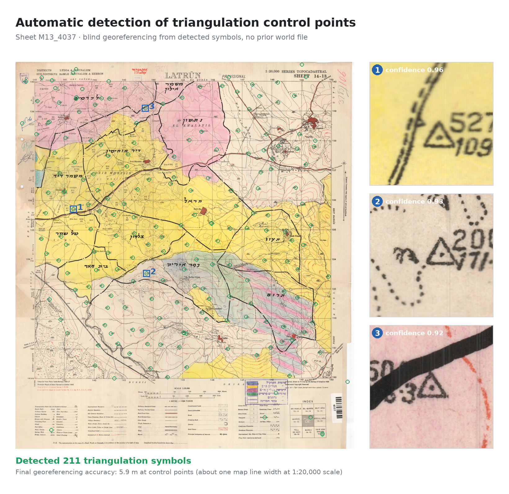
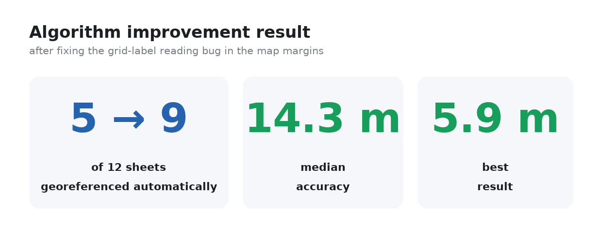
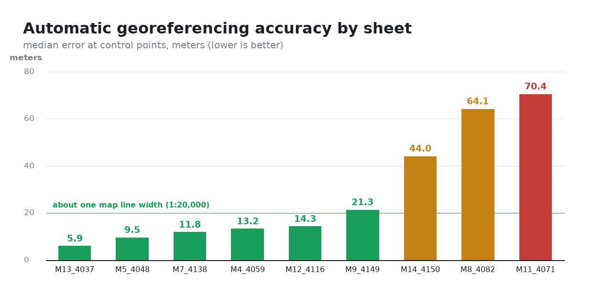
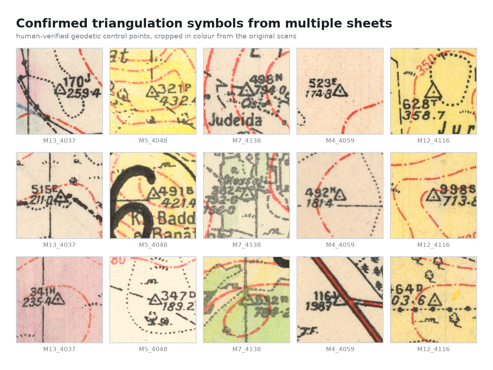

# AutoGeoReferencing

> **Public showcase of a tool I built while working on a cadastral map-digitization project.** The working
> repository is private — it holds the development history, the client's map archive
> and site-specific configuration. This version carries the code, the documentation
> and public-domain example imagery only, which is why it lands as a single commit.

**Automatic georeferencing of scanned 1:20,000 historical maps of Palestine (1940s).**

These maps are printed with small **triangulation-point symbols** (a triangle with a
central dot) that mark known geodetic control points. This project detects those symbols
with a CNN, matches them to a geodetic control-point database, and solves for the
pixel → world affine transform — turning a loose scan into a georeferenced map with a
world file, with no manual control-point picking.



> The map above is a public-domain 1943 Survey of Palestine sheet. Every green marker is
> an automatically detected control-point symbol; the pipeline used them to georeference
> the sheet "blind" (no prior world file) to within ~6 m.

---

## Results

The pipeline is evaluated on **held-out sheets it never saw during training**, comparing
its automatic transform against human-verified ground truth. Error is measured in meters
at the control points.





On the best sheets the automatic georeference lands within **~6 m** — roughly one line-width
at 1:20,000. Harder sheets (faint symbols, damaged margins, sparse control) still bootstrap
a usable transform that a human can refine, and a few remain failures flagged for manual work.
The system reports its own confidence so failures are caught, not shipped.

---

## How it works

The hard part is that a scan arrives with **no georeferencing at all** — not even an
approximate location. The pipeline bootstraps from what's printed on the map itself.

```
scan (no world file)
      │
      ▼
1. OCR the grid-coordinate labels in the map margins        grid_label_ocr.py
      │   → a rough "Old Palestine Grid" affine
      ▼
2. Project the geodetic control-point DB into the image     db_matcher.py
      │   → candidate pixel locations for each known point
      ▼
3. Template-match + CNN-verify each candidate               train_classifier.py
      │   → confirmed triangulation symbols (reject false positives)
      ▼
4. Fit a robust affine (RANSAC) pixel → EPSG:6991           bootstrap_from_grid.py
      │   → world file (.tfwx), inlier/outlier report
      ▼
georeferenced map + confidence
```

Two operating modes:

- **Bootstrap mode** (no prior georeferencing) — the full chain above. Entry point:
  `scripts/run_bootstrap.py`.
- **Auto mode** (map already has an approximate world file) — skip OCR, project the DB
  directly, re-verify every point and refit a clean affine. Entry point:
  `scripts/auto_georeference.py`.

### The symbol detector

A small purpose-built CNN (`TriangleCNN`, ~191K params) classifies 64×64 grayscale crops
as triangulation-symbol / not. The maps are colour scans, so a **red-suppression**
preprocessing step (`min(B, G)`) removes the red/brown contour and boundary lines while
keeping the black symbol ink — this alone is a large accuracy win.



The classifier is trained through an active-learning loop: run the detector over full
maps, review the candidates in a lightweight HTML labeler, fold the corrections back into
training, and re-evaluate on a **frozen held-out test set** for a stable, comparable
metric across runs.

---

## Repository layout

| Path | What's there |
|------|--------------|
| `scripts/` | The pipeline: OCR, matching, CNN training, georeferencing, evaluation, GUIs |
| `scripts/test_pipeline.py` | Pure-logic regression tests (OCR post-processing, affine fitting, world-file round-trips) |
| `archive/` | Earlier detector generations (HOG+SVM, first-gen template matcher, GBM) — kept to show the evolution |
| `docs/images/` | Result figures used in this README |

Key modules:

- `grid_label_ocr.py` — reads the printed grid labels; returns `None` when the fit is untrustworthy.
- `bootstrap_from_grid.py` — Old-Grid ↔ EPSG:6991 conventions and the RANSAC affine fit.
- `db_matcher.py` — projects the control-point DB into an image and verifies candidates.
- `train_classifier.py` — the `TriangleCNN` and its training loop.
- `evaluate_holdout.py` / `evaluate_end_to_end.py` — precision/recall/F1 and end-to-end meters.

---

## Notes on data & reproducibility

This is a **code showcase**. The inputs it runs on — the copyrighted geodetic
control-point database and the scanned map imagery from an archival project — are **not
included** in this repository, and the trained model weights (learned from those scans) are
likewise omitted. The result figures above were produced from public-domain
Survey of Palestine sheets.

The code is therefore published to demonstrate the approach and engineering, not as a
turnkey tool. Running it end-to-end requires supplying your own control-point database and
map scans in the layout described by `scripts/data_paths.py`.

## Tech

Python · PyTorch (custom CNN) · OpenCV (template matching, preprocessing) · EasyOCR ·
NumPy · RANSAC affine estimation · PIL. GDAL/QGIS-compatible world-file output
(`.tfwx`), target CRS **EPSG:6991** (Israeli Grid).

## License

Code released under the [MIT License](LICENSE). The historical map imagery shown in the
figures is in the public domain (Survey of Palestine, 1940s).
